## Introduction

Systematic reviews are the gold standard for evidence synthesis, but they're **time-consuming** and **resource-intensive**. A typical review takes 12-18 months and requires screening thousands of abstracts.

**Large Language Models (LLMs)** are changing this. Here's a practical guide to using AI at every stage of the systematic review pipeline.

## The Systematic Review Pipeline

```mermaid
flowchart LR
    A1[Define Question] --> A2[Write Protocol]
    A2 --> A3[Develop Search]
    A3 --> A4[Retrieve References]
    A4 --> A5[Screen Abstracts]
    A5 --> A6[Retrieve Full Texts]
    A6 --> A7[Extract Data]
    A7 --> A8[Critical Appraisal]
    A8 --> A9[Synthesis]
    A9 --> A10[Meta-analysis]
    A10 --> A11[Write Results]
    A11 --> A12[Dissemination]
```



Let's explore AI opportunities at each stage.

---

## Stage 1: Define Research Question

### What AI Can Do
- Suggest PICO/PECO elements from natural language descriptions
- Refine and clarify research questions
- Identify related systematic reviews to avoid duplication

### Tools & Resources
| Tool | Use Case |
|------|----------|
| ChatGPT/Claude | Brainstorm and refine PICO elements |
| Consensus.app | Search for existing reviews on your topic |
| PROSPERO | Check for registered protocols |

### Example Prompt
```
I want to study the effects of cash transfer programs on poverty 
reduction in Sub-Saharan Africa. Help me define:
- Population (P)
- Intervention (I)  
- Comparison (C)
- Outcomes (O)
```

---

## Stage 2: Write Protocol & Register

### What AI Can Do
- Draft protocol sections based on templates
- Ensure completeness against PRISMA-P checklist
- Suggest methodology based on review type

### Tools & Resources
| Tool | Use Case |
|------|----------|
| ChatGPT/Claude | Draft protocol sections |
| PROSPERO | Protocol registration |
| PRISMA-P Checklist | Ensure completeness |

### Best Practice
Always have humans review AI-generated protocol text. Use AI for first drafts, not final versions.

---

## Stage 3: Develop Search Strategy

### What AI Can Do
- Generate search terms and synonyms
- Build Boolean logic strings
- Translate searches across databases (PubMed → Scopus → Web of Science)

### Tools & Resources
| Tool | Use Case |
|------|----------|
| ChatGPT/Claude | Generate search terms, Boolean strings |
| Polyglot Search | Translate searches across databases |
| PubMed MeSH Browser | Identify controlled vocabulary |

### Example Prompt
```
Generate a comprehensive search strategy for PubMed to find 
studies on "school feeding programs" and "academic achievement" 
in low-income countries. Include:
- MeSH terms
- Free text synonyms
- Boolean operators
```

---

## Stage 4: Retrieve References

### What AI Can Do
- Automate reference downloads from multiple databases
- Deduplicate across sources
- Enrich metadata (add abstracts, DOIs)

### Tools & Resources
| Tool | Use Case |
|------|----------|
| OpenAlex API | Free, comprehensive reference retrieval |
| Europe PMC API | Open access full texts |
| Unpaywall | Find open access versions |
| ASReview | Import and manage references |

### Pro Tip
Use OpenAlex's free API for comprehensive coverage—it includes Crossref, PubMed, and more.

---

## Stage 5: Screen Titles & Abstracts ⭐

### What AI Can Do
- **Priority screening**: Rank references by relevance
- **Dual screening replacement**: AI as second reviewer
- **Stopping rules**: Determine when to stop screening

### Tools & Resources
| Tool | Use Case | AI Model |
|------|----------|----------|
| **ASReview** | Active learning for screening | Multiple |
| **Rayyan** | Collaborative screening | Proprietary |
| **Abstrackr** | Machine learning screening | ML-based |
| **Nested Knowledge** | AI-assisted screening | Proprietary |
| **Covidence** | End-to-end review platform | ML-based |

### The State of the Art

Recent research shows:
- AI can reduce screening workload by **36-72%** while maintaining sensitivity
- Dual screening with AI achieves comparable accuracy to human-human
- **Stopping rules** help determine when you've found enough (see my other post on this!)

{}
**Validation is essential!** Always validate AI screening on a random sample before full deployment. See my tutorial on [Why Fixed-Sample AI Screening Validation Fails](/post/ai-screening-validation/).
{}

---

## Stage 6: Retrieve Full Texts

### What AI Can Do
- Automatically find PDFs from DOIs and URLs
- Extract text from PDFs for downstream processing
- Identify supplementary materials

### Tools & Resources
| Tool | Use Case |
|------|----------|
| Unpaywall API | Find open access PDFs |
| CORE API | Repository full texts |
| Sci-Hub | (Use with caution, ethical considerations) |
| PyMuPDF/pdfplumber | Extract text from PDFs |

---

## Stage 7: Extract Data ⭐

### What AI Can Do
- Extract structured data from full-text articles
- Identify PICO elements, sample sizes, effect sizes
- Handle tables and figures

### Tools & Resources
| Tool | Use Case |
|------|----------|
| **GROBID** | Structure extraction from PDFs |
| **RobotReviewer** | RCT data extraction |
| **MetaBeeAI** | Full pipeline for bio-reviews |
| ChatGPT/Claude | Custom extraction prompts |

### Example Prompt
```
Extract the following from this study:
- Study design (RCT, quasi-experimental, observational)
- Sample size (total, treatment, control)
- Country/setting
- Intervention description
- Primary outcomes and effect sizes
- Follow-up duration

Format as JSON.
```

### Accuracy Benchmarks
Recent evaluations show:
- **Data extraction**: >84% accuracy, F1 >90%
- **Study characteristics**: Generally reliable
- **Effect sizes**: Requires verification

---

## Stage 8: Critical Appraisal

### What AI Can Do
- Assess risk of bias using standard tools (RoB 2, ROBINS-I)
- Flag potential quality issues
- Suggest domain-specific concerns

### Tools & Resources
| Tool | Use Case |
|------|----------|
| RobotReviewer | Automated RoB assessment |
| ChatGPT/Claude | RoB domain evaluation |
| Custom prompts | Tool-specific assessment |

### Current Limitations
- **Interpretive tasks** are challenging for AI
- RoB assessment often requires judgment, not just extraction
- **Recommendation**: Use AI as first-pass, human verification essential

---

## Stage 9: Synthesis of Results

### What AI Can Do
- Summarize findings across studies
- Identify patterns and themes
- Generate narrative synthesis drafts

### Tools & Resources
| Tool | Use Case |
|------|----------|
| ChatGPT/Claude | Narrative synthesis drafts |
| Custom RAG systems | Grounded synthesis from your evidence |
| Elicit | Research assistant for synthesis |

### Best Practice
Build a **Retrieval-Augmented Generation (RAG)** system for synthesis. This grounds the LLM in your actual evidence, reducing hallucinations. See my [tutorial on building a RAG system for research](/post/building-ai-research-qa-system/).

---

## Stage 10: Meta-Analysis (Optional)

### What AI Can Do
- Suggest appropriate statistical methods
- Help with R/Python code for meta-analysis
- Interpret heterogeneity and sensitivity analyses

### Tools & Resources
| Tool | Use Case |
|------|----------|
| R (meta, metafor) | Statistical analysis |
| Python (PythonMeta) | Alternative to R |
| ChatGPT Code Interpreter | Generate and debug analysis code |

### Example Prompt
```
I have effect sizes (standardized mean differences) from 15 RCTs 
on educational interventions. Help me:
1. Conduct a random-effects meta-analysis in R
2. Create a forest plot
3. Assess heterogeneity (I², Q-statistic)
4. Run publication bias tests (funnel plot, Egger's test)
```

---

## Stage 11: Write Results

### What AI Can Do
- Draft methods and results sections
- Generate PRISMA flow diagrams
- Format references consistently

### Tools & Resources
| Tool | Use Case |
|------|----------|
| ChatGPT/Claude | Draft writing |
| PRISMA 2020 | Flow diagram generator |
| Zotero/Mendeley | Reference management |

---

## Stage 12: Dissemination

### What AI Can Do
- Generate plain-language summaries
- Create social media content
- Translate findings for different audiences

### Tools & Resources
| Tool | Use Case |
|------|----------|
| ChatGPT/Claude | Plain-language summaries |
| Podcast generation | Audio summaries (experimental) |
| Infographic tools | Visual summaries |

---

## Summary: AI Readiness by Stage

| Stage | AI Readiness | Recommendation |
|-------|--------------|----------------|
| Define Question | 🟢 High | Use freely with human review |
| Write Protocol | 🟡 Medium | Draft assistance only |
| Search Strategy | 🟢 High | Excellent for term generation |
| Retrieve References | 🟢 High | Fully automatable |
| **Screen Abstracts** | 🟢 High | Major time-saver, validate! |
| Retrieve Full Texts | 🟢 High | Fully automatable |
| **Extract Data** | 🟡 Medium | Good accuracy, verify numbers |
| Critical Appraisal | 🔴 Low | Human judgment essential |
| Synthesis | 🟡 Medium | Use RAG for grounding |
| Meta-Analysis | 🟡 Medium | Code assistance helpful |
| Write Results | 🟡 Medium | Draft assistance only |
| Dissemination | 🟢 High | Excellent for summaries |

---

## Key Takeaways

1. **Screening is the biggest win**—AI can reduce workload by 50-70%
2. **Extraction is promising**—but verify critical numbers
3. **Appraisal needs humans**—interpretive tasks remain challenging
4. **Synthesis needs grounding**—use RAG, not free-form LLMs
5. **Validate everything**—AI errors can propagate through the review

---

{}
This guide is based on my experience leading systematic reviews at 3ie and developing AI tools for evidence synthesis. For questions or collaboration, please reach out!
{}
